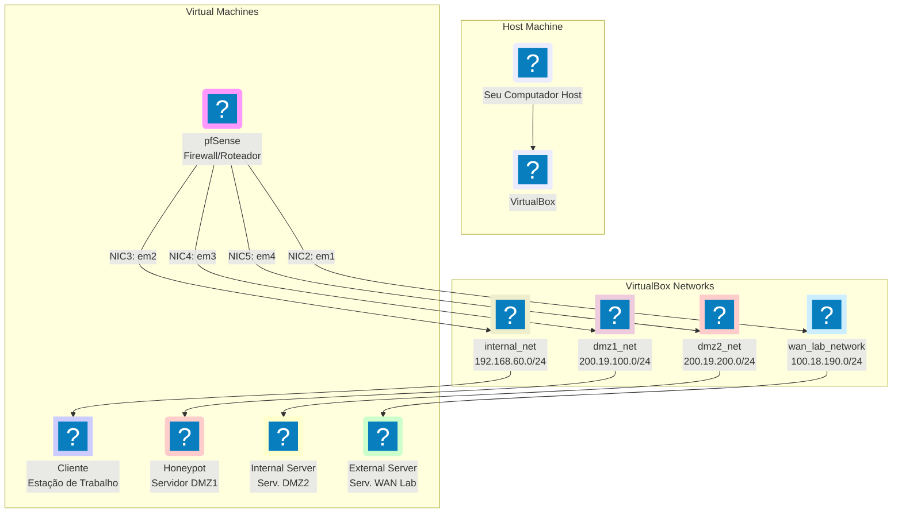

## Trabalho Prático de Segurança em Redes: Implementação de Rede Segura com pfSense

### Cenário da Empresa SecureNet Labs

A **SecureNet Labs**, uma pequena empresa de consultoria, está montando um novo escritório. Eles precisam de uma infraestrutura de rede robusta e segura que garanta a conectividade dos colaboradores, o isolamento de servidores internos e o monitoramento do tráfego para detecção de ameaças. O pfSense será o coração dessa infraestrutura de segurança, atuando como firewall principal, roteador e plataforma para serviços de segurança avançados.

### Objetivo do Aluno

O aluno será responsável por configurar o pfSense para atender a todos os requisitos de segurança e conectividade da SecureNet Labs, utilizando suas principais funcionalidades de firewall, proxy (Squid) e IDS/IPS (Snort), além da implementação de **honeypots** para coleta de inteligência sobre ameaças.

-----

### Parte 0: Implantação da Topologia de Laboratório

O primeiro passo para o sucesso deste trabalho prático é a correta implantação da topologia de laboratório. Você utilizará o **Vagrant** e o **VirtualBox** para orquestrar a criação e o gerenciamento das máquinas virtuais que compõem este ambiente de rede simulado.

#### 0.1. Requisitos de Hardware e Software (Host)

Certifique-se de que seu computador (Host) atende aos seguintes requisitos mínimos e possui os softwares instalados:

##### 0.1.1. Requisitos de Hardware:

Considerando que você terá 5 VMs, cada uma consumindo 1 GB de RAM, o consumo total de RAM das VMs será de 5 GB. Além disso, o sistema operacional do host e outros aplicativos também consomem RAM.

  * **Processador (CPU):** Intel Core i5 de 8ª geração ou AMD Ryzen 5 2000-series ou superior, com suporte a virtualização de hardware (Intel VT-x / AMD-V) habilitado na BIOS/UEFI.
  * **Memória RAM:** Mínimo de 8 GB de RAM (para 5 VMs de 1GB cada, mais o sistema host, pode ser um gargalo). **Idealmente, 16 GB ou mais para uma experiência mais fluida e para acomodar o sistema operacional do host e outros aplicativos que podem estar em uso.**
  * **Armazenamento (SSD):** Mínimo de 100 GB de espaço livre em disco SSD. Um SSD é crucial para o desempenho das VMs, especialmente durante a instalação e uso, acelerando as operações de leitura e escrita.
  * **Conexão com a Internet:** Necessária para baixar as *boxes* do Vagrant, pacotes de sistemas operacionais e regras do Snort/Squid.

##### 0.1.2. Requisitos de Software:

**No Windows:**

1.  **Git:**
      * Baixe e instale o Git for Windows (com Git Bash) do [site oficial](https://git-scm.com/download/win). Certifique-se de habilitar a opção "Git from the command line and also from 3rd-party software" durante a instalação.
2.  **Chocolatey (Gerenciador de Pacotes - Altamente Recomendado):**
      * Abra o `PowerShell` como **Administrador**.
      * Execute o comando de instalação do Chocolatey:
        ```powershell
        Set-ExecutionPolicy Bypass -Scope Process -Force; [System.Net.ServicePointManager]::SecurityProtocol = [System.Net.ServicePointManager]::SecurityProtocol -bor 3072; iex ((New-Object System.Net.WebClient).DownloadString('https://chocolatey.org/install.ps1'))
        ```
      * **Importante:** Após a instalação, feche e reabra o `PowerShell` como Administrador para que as alterações de ambiente entrem em vigor.
3.  **VirtualBox:**
      * **Via Chocolatey:** `choco install virtualbox --version=X.X.X` (substitua `X.X.X` pela versão mais recente, por exemplo, `7.0.18`).
      * **Manual:** Baixe o instalador diretamente do [site oficial do VirtualBox](https://www.virtualbox.org/wiki/Downloads) e siga as instruções de instalação.
4.  **Vagrant:**
      * **Via Chocolatey:** `choco install vagrant --version=X.X.X` (substitua `X.X.X` pela versão mais recente, por exemplo, `2.4.1`).
      * **Manual:** Baixe o instalador diretamente do [site oficial do Vagrant](https://www.google.com/search?q=https://developer.hashicorp.com/vagrant/downloads) e siga as instruções de instalação.
5.  **Vagrant Plugin: `vagrant-vbguest`**
      * Abra o terminal ou PowerShell e instale o plugin:
        ```bash
        vagrant plugin install vagrant-vbguest
        ```
6.  **Python 3:**
      * **Via Chocolatey:** `choco install python --version=X.X.X` (substitua `X.X.X` pela versão mais recente, por exemplo, `3.10.11`).
      * **Manual:** Baixe o instalador do [site oficial do Python](https://www.python.org/downloads/). **Certifique-se de marcar a opção "Add Python to PATH" durante a instalação.**

**No Linux (Ubuntu/Debian como exemplo):**

1.  **Git:**
      * Instale o Git: `sudo apt update && sudo apt install -y git`
2.  **VirtualBox:**
      * Instale o VirtualBox: `sudo apt update && sudo apt install -y virtualbox`
      * Adicione seu usuário ao grupo `vboxusers` para permitir a interação com o VirtualBox sem `sudo`: `sudo usermod -aG vboxusers $USER` (faça logout e login novamente para aplicar a mudança).
3.  **Vagrant:**
      * Baixe o pacote `.deb` do [site oficial do Vagrant](https://www.google.com/search?q=https://developer.hashicorp.com/vagrant/downloads).
      * Instale-o: `sudo dpkg -i vagrant_X.X.X_Y.deb` (substitua `X.X.X_Y` pela versão baixada, por exemplo, `2.4.1_amd64`).
      * Se houver erros de dependência, corrija-os: `sudo apt install -f`.
4.  **Vagrant Plugin: `vagrant-vbguest`**
      * Abra o terminal e instale o plugin:
        ```bash
        vagrant plugin install vagrant-vbguest
        ```
5.  **Python 3:**
      * O Python 3 geralmente já vem pré-instalado na maioria das distribuições Linux.
      * **Instale o módulo `venv` (se ainda não estiver presente):**
        ```bash
        sudo apt update
        sudo apt install -y python3-venv
        ```
      * Verifique a versão do Python: `python3 --version`.

#### 0.2. Passos para Implantação da Topologia:

1.  **Baixe o Repositório do GitHub:**

      * Crie uma pasta vazia em seu sistema host onde você deseja armazenar o laboratório, por exemplo, `~/laboratorio_pfsense`.
      * Abra o terminal (Git Bash no Windows, ou terminal no Linux) e navegue até essa pasta.
      * Clone o repositório do GitHub (substitua `URL_DO_SEU_REPOSITORIO` pela URL real do repositório fornecido pelo seu instrutor):
        ```bash
        git clone URL_DO_SEU_REPOSITORIO
        ```
      * Navegue para a pasta do repositório que foi criada (ex: `cd nome_do_repositorio_baixado`). Dentro desta pasta, você encontrará o `setup_lab.py` e o `pfsense_base_config.xml`, e também o `requirements.txt`.

2.  **Crie e Ative um Ambiente Virtual Python:**

      * Para isolar as dependências do projeto e evitar conflitos com outras instalações Python em seu sistema, crie um ambiente virtual:
        ```bash
        python3 -m venv venv_lab
        ```
      * Ative o ambiente virtual:
          * **No Linux/Git Bash:** `source venv_lab/bin/activate`
          * **No Windows (PowerShell):** `.\venv_lab\Scripts\Activate.ps1`
      * Você verá `(venv_lab)` ou um prefixo similar no seu prompt de comando, indicando que o ambiente virtual está ativo.

3.  **Instale as Dependências Python:**

      * Com o ambiente virtual ativado, instale as bibliotecas Python necessárias para o `setup_lab.py` a partir do arquivo `requirements.txt`:
        ```bash
        pip install -r requirements.txt
        ```

4.  **Gere o `Vagrantfile` e as Redes Host-Only:**

      * Ainda dentro da pasta do repositório e com o ambiente virtual ativo, execute o script Python:
        ```bash
        python3 setup_lab.py
        ```
      * O script perguntará: "Deseja criar as redes host-only? (s/N)".
          * **Responda `s` (sim) e pressione Enter APENAS se as redes host-only (requeridas pelo laboratório) ainda não existirem no seu VirtualBox.** O script irá criá-las e configurá-las.
          * Se as redes já existirem (por exemplo, de uma execução anterior do script), digite `N` (não) e pressione Enter. O script então pedirá para você informar manualmente os nomes das redes host-only existentes no seu VirtualBox, garantindo a reutilização.
      * Após a criação (ou identificação) das redes host-only, o script gerará o arquivo `Vagrantfile` na mesma pasta.

5.  **Implante as Máquinas Virtuais:**

      * Com o `Vagrantfile` e o `pfsense_base_config.xml` na pasta do repositório, e **ainda com o ambiente virtual ativo**, execute no terminal:
        ```bash
        vagrant up
        ```
      * O Vagrant baixará as *boxes* necessárias (se ainda não as tiverem sido baixadas anteriormente) e iniciará todas as VMs definidas na topologia (pfSense, Cliente, Honeypot, Internal Server, External Server).
      * Após a criação inicial da topologia, utilize `vagrant suspend` e `vagrant resume` para pausar e retomar as VMs, respectivamente. Isso economiza tempo e evita recriações desnecessárias:
        ```bash
        vagrant suspend
        vagrant resume
        ```
      * **Observe:** O pfSense iniciará com sua configuração padrão de fábrica. A configuração inicial do sistema operacional das VMs Cliente, Honeypot, Internal Server e External Server será aplicada automaticamente pelo Vagrant.

6.  **Importe o `pfsense_base_config.xml` na GUI do pfSense (Passo Obrigatório para o Aluno):**

      * **Acesse a GUI do pfSense:**

          * Após a VM do pfSense iniciar e ser totalmente provisionada pelo Vagrant (mesmo que com as configurações padrão de fábrica), você poderá tentar acessá-la.
          * Para acessar a GUI do pfSense a partir da sua máquina host, abra um navegador web e use a porta redirecionada no Vagrant: **`https://localhost:8443`**. Isso irá direcioná-lo para a interface de gerenciamento do pfSense.
          * Faça login com as credenciais padrão da *box* `kennyl/pfsense` (geralmente `admin`/`pfsense`).

      * **Navegue até a Seção de Backup/Restauração:**

          * No menu superior da GUI do pfSense, vá em `Diagnostics` \> `Backup & Restore`.

      * **Faça o Upload do Arquivo:**

          * Na seção **Restore Configuration**, clique no botão `Choose File` (ou `Procurar...`).
          * Localize o arquivo `pfsense_base_config.xml` que você baixou do repositório e salvou no diretório de trabalho.
          * **Opções de Restauração:** Certifique-se de que `Restore area` esteja selecionado como `All` (para restaurar todas as configurações, incluindo interfaces, firewall, etc.).
          * Clique no botão **Restore Configuration**.

      * **Aguarde a Reinicialização:**

          * O pfSense irá processar o arquivo, aplicar as configurações e, em seguida, **reiniciar**. Este processo pode levar alguns minutos.
          * Após o reboot, ele deverá estar com as configurações carregadas do `config.xml` que você importou, e o laboratório estará pronto para que você inicie as tarefas de configuração detalhada.

7.  **Atualize a versão do pfSense usando a GUI (Passo Obrigatório para o Aluno):**

      * **Por que atualizar o Pfsense?**
  
          * É necessário atualizar o pfSense para conseguir instalar o Squid e o Snort. 
  
      * **Procedimento:**

          *  Vá em Sistema > Atualizar > Configurações de Atualização (Aba)
          *  Selecione “Versão estável anterior (2.4.X - Deprecated)” em vez de “Última versão estável (2.4.x)” na lista suspensa de Ramificações. Eu selecionei “Versão estável anterior (2.4.5 - Deprecated)”, mas ela só apareceu depois que selecionei “Versão estável anterior (2.4.4 - Deprecated)”, sai da tela e voltei
          *  Clique em “Salvar”
          *  Vá agora na Aba "Atualização de Sofware". Deve aparecer uma nova versão para instalação. Aí é só mandar ver.
          *  Depois da instalação, o pfsense reiniciará. Então, será possível instalar os pacotes
          *  **Observe:** Após a atualização, use apenas o vagrant suspend/resume para manter o estado da VM. 

#### 0.3. Topologia de Rede do Laboratório:

A infraestrutura de rede simulada neste laboratório segue a seguinte arquitetura:


**Descrição da Topologia:**

  * **pfSense**: Atua como o firewall central e roteador, interconectando todas as redes internas do laboratório.

      * `NIC1` (`em0`): Configurada pelo Vagrant como NAT para gerenciamento (SSH) e acesso à internet do host.
      * `NIC2` (`em1`): Conectada à rede Host-Only `internet_net` (simulando a WAN/Internet).
          * **IP configurado no pfSense:** `100.18.190.254/24`
      * `NIC3` (`em2`): Conectada à rede Host-Only `internal_net` (simulando a LAN interna).
          * **IP configurado no pfSense:** `192.168.60.254/24`
      * `NIC4` (`em3`): Conectada à rede Host-Only `dmz1_net`.
          * **IP configurado no pfSense:** `200.19.100.254/24`
      * `NIC5` (`em4`): Conectada à rede Host-Only `dmz2_net`.
          * **IP configurado no pfSense:** `200.19.200.254/24`
      * **Port Forwarding para GUI:** `guest: 443` -\> `host: 8443` (permite acessar a GUI do pfSense do host via `https://localhost:8443`).

  * **cliente**: Uma estação de trabalho simulando um usuário interno na rede LAN.

      * `NIC1`: Configurada pelo Vagrant como NAT para gerenciamento (SSH) e acesso à internet do host.
      * `NIC2`: Conectada à rede Host-Only `internal_net`.
          * **IP:** `192.168.60.10/24`
          * **Gateway:** `192.168.60.254` (o pfSense)
          * **DNS:** `8.8.8.8`

  * **honeypot**: Um servidor dedicado a hospedar honeypots, localizado na DMZ1.

      * `NIC1`: Configurada pelo Vagrant como NAT para gerenciamento (SSH) e acesso à internet do host.
      * `NIC2`: Conectada à rede Host-Only `dmz1_net`.
          * **IP:** `200.19.100.10/24`
          * **Gateway:** `200.19.100.254` (o pfSense)
          * **DNS:** `8.8.8.8`

  * **internal-server**: Um servidor interno, localizado na DMZ2.

      * `NIC1`: Configurada pelo Vagrant como NAT para gerenciamento (SSH) e acesso à internet do host.
      * `NIC2`: Conectada à rede Host-Only `dmz2_net`.
          * **IP:** `200.19.200.10/24`
          * **Gateway:** `200.19.200.254` (o pfSense)
          * **DNS:** `8.8.8.8`

  * **external-server**: Um servidor simulando um recurso externo na rede "Internet" de laboratório.

      * `NIC1`: Configurada pelo Vagrant como NAT para gerenciamento (SSH) e acesso à internet do host.
      * `NIC2`: Conectada à rede Host-Only `internet_net`.
          * **IP:** `100.18.190.10/24`
          * **Gateway:** `100.18.190.254` (o pfSense)
          * **DNS:** `8.8.8.8`



-----

### Tarefas do Aluno:

O aluno deverá realizar as seguintes configurações no pfSense, registrando os passos e as regras criadas (capturas de tela da GUI ou trechos de configuração do XML/CLI):

#### Parte 1: Configurações Básicas e Firewall (Regras de Filtro)

1.  **Configurações Iniciais (Verificar)**:

      * Confirmar que o hostname (`pfsense`), domínio (`lab.local`), servidor DNS (`8.8.8.8`) e fuso horário (`America/Fortaleza`) estão corretos.
      * Verificar que as interfaces WAN, LAN, DMZ1 e DMZ2 estão configuradas com os IPs e subnets corretos (`em1`=WAN, `em2`=LAN, `em3`=DMZ1, `em4`=DMZ2).
      * Verificar que o assistente inicial está desabilitado na GUI.

2.  **Regras de Firewall na LAN (Entrada)**:

      * **NAT de Saída (Outbound NAT) para Acesso à WAN**:
          * Configurar o NAT de Saída no pfSense para que a sub-rede da LAN (`192.168.60.0/24`) possa acessar a sub-rede da WAN (`100.18.190.0/24`). Isso é essencial para que o `cliente` (que tem IPs privados) consiga se comunicar com o `external-server` (que está em uma "rede pública" simulada no laboratório).
          * *Navegação na GUI:* `Firewall` \> `NAT` \> `Outbound`.
          * *Modo:* Mudar para `Hybrid Outbound NAT rule generation` ou `Manual Outbound NAT rule generation` (se não estiver já) e adicionar uma regra.
          * *Regra:* Origem: `LAN net`, Destino: `WAN net` (ou `100.18.190.0/24`), NAT de tradução para o endereço IP da interface WAN do pfSense.
      * **Acesso à Internet (simulada)**: Permitir que o `cliente` (192.168.60.10) acesse o `external-server` (100.18.190.10) nas portas HTTP (80), HTTPS (443) e DNS (53).
      * **Acesso à DMZ1 (Honeypot)**: Bloquear todo o tráfego da LAN para o `honeypot` (200.19.100.10), exceto a porta SSH (22). *Objetivo: Demonstrar o controle de acesso a um segmento de rede isolado (DMZ).*
      * **Acesso à DMZ2 (Internal Server)**: Permitir que o `cliente` acesse o `internal-server` (200.19.200.10) nas portas HTTP (80), HTTPS (443) e FTP (21)
      * **Bloqueio Geral**: Criar uma regra final na interface LAN que bloqueie qualquer outro tráfego de saída não explicitamente permitido, para as redes DMZ1, DMZ2 e WAN.

3.  **Regras de Firewall na WAN (Entrada)**:

      * **Proteção WAN**: Bloquear todo o tráfego de entrada na interface WAN que não seja resposta a uma conexão iniciada internamente (regra padrão do pfSense, mas verificar e garantir que está ativa).
      * **Acesso SSH de Emergência**: Criar uma regra que permita acesso SSH (porta 22) de um IP específico (simular o IP do seu host, por exemplo) para a interface WAN do pfSense, apenas para fins de gerenciamento remoto. *Isso simula um acesso administrativo seguro de fora.*

4.  **Regras de Firewall nas DMZs (Entrada/Saída)**:

      * **DMZ1 (Honeypot)**:
          * Ver a Parte 4 (Configuração do Honeywall)          
      * **DMZ2 (Internal Server)**:
          * **Acesso do External Server**: Permitir que o `external-server` (100.18.190.10) acesse diretamente o `internal-server` (200.19.200.10) nas portas HTTP (80) e HTTPS (443).
          * Bloquear qualquer tráfego direto entre DMZ1 e DMZ2. *Objetivo: Enfatizar o isolamento entre diferentes DMZs.*

5.  **Aliases de Rede/Porta**: Criar aliases para grupos de IPs (Ex: "Redes\_Internas" para LAN + DMZs) e grupos de portas (Ex: "Serviços\_Web" para 80, 443) para melhorar a legibilidade e a manutenção das regras de firewall.

#### Parte 2: Proxy Web com Squid

1.  **Instalação e Habilitação**:

      * **Instalar o pacote Squid** via `System` \> `Package Manager` \> `Available Packages`.
      * Habilitar o Squid como **proxy transparente** na interface LAN.

2.  **Restrições de Acesso**:

      * **Bloqueio de Sites por Blacklist**: O aluno deverá pesquisar e selecionar uma **blacklist de URLs ou domínios** na internet (ex: listas de domínios maliciosos ou de redes sociais para controle de acesso). Configurar o Squid para utilizar esta blacklist.
      * **Bloqueio de Domínio Específico**: Adicionar manualmente o domínio `external-fake.com` (presente na sua rede de laboratório) a esta blacklist ou a uma lista separada de domínios bloqueados no Squid.
      * **Permitir Acesso Específico**: Garantir que o `cliente` (192.168.60.10) consiga acessar `external.com` (100.18.190.10) através do proxy, provando que nem tudo é bloqueado.
      * **Limitação de Tamanho**: Configurar um limite para o tamanho máximo de objetos que o Squid armazenará em cache, para otimizar o uso de disco.

3.  **Monitoramento do Cache**:

      * Verificar o status do cache do Squid na GUI.
      * Limpar o cache do Squid para testes.

#### Parte 3: Sistema de Detecção/Prevenção de Intrusões com Snort

1.  **Instalação e Habilitação**:

      * **Instalar o pacote Snort** via `System` \> `Package Manager` \> `Available Packages`.
      * Habilitar o Snort nas interfaces **WAN** e **LAN**.

2.  **Configuração de Regras**:

      * **Regras Padrão**: Configurar o Snort para baixar e atualizar as regras da comunidade (Oinkmaster Code ou Emerging Threats, configurando a chave Oinkcode, se necessário).
      * **Alerta de Acesso a Domínio Específico**: Criar uma regra customizada no Snort para gerar um alerta quando houver uma tentativa de acesso HTTP (porta 80) do `cliente` para o domínio `external-fake.com` (que está no `external-server`). *Isso simulará a detecção de acesso a um site indesejado ou potencialmente malicioso.*

3.  **Monitoramento de Alertas**:

      * Verificar os logs de alerta do Snort na GUI.
      * Limpar os alertas do Snort para uma nova rodada de testes.

#### Parte 4: Honeypots e Honeywall no pfSense

1.  **Instalação e Configuração de Honeypots na VM `honeypot`:**

      * A VM `honeypot` já terá o Docker e Docker Compose instalados. O aluno deverá utilizar o Docker para instalar e configurar os seguintes honeypots:
          * **Glastopf**:
              * **Descrição**: É um honeypot de baixo nível para servidores web que emula vulnerabilidades web comuns (como *Local File Inclusion*, *Remote File Inclusion*, *Cross-Site Scripting*). Seu propósito é enganar scanners de vulnerabilidades e *bots* maliciosos, coletando informações valiosas sobre suas táticas e ferramentas.
              * **Tarefa**: Instalar o Glastopf via Docker na VM `honeypot` (200.19.100.10) e garantir que ele esteja escutando na porta HTTP (80 ou outra, se necessário) do `honeypot`.
              * **Observe**: Alguns alunos reportaram que ele não funciona mais. Nesse caso, você poderá implantar outro Honeypot Web de sua escolha. Não precisa nem usar Docker.
          * **Cowrie**:
              * **Descrição**: É um honeypot de médio nível que simula um servidor SSH e Telnet. Ele registra as interações de atacantes, incluindo senhas digitadas, comandos executados e arquivos baixados, fornecendo inteligência detalhada sobre ataques de força bruta, dicionário e exploração de credenciais.
              * **Tarefa**: Instalar o Cowrie via Docker na VM `honeypot` (200.19.100.10) e garantir que ele esteja escutando na porta SSH (22 ou outra) do `honeypot`.

2.  **Configuração de Honeywall no pfSense:**

      * Para evitar que um atacante que consiga invadir um honeypot na DMZ1 use essa máquina como pivô para invadir outras redes internas (como a LAN ou DMZ2), o aluno deverá configurar um **Honeywall** no pfSense. Um Honeywall é um firewall projetado para isolar honeypots.
      * **Tarefa**: Criar regras de firewall explícitas na interface **DMZ1** do pfSense que:
          * Permitir que o `external-server` (100.18.190.10) ping o `honeypot` (200.19.100.10).
          * Permitam que as portas dos honeypots (ex: 80 para Glastopf, 22 para Cowrie) na VM `honeypot` (200.19.100.10) recebam tráfego APENAS da rede WAN (simulada).
          * **Bloqueiem ABSOLUTAMENTE todo o tráfego de SAÍDA do `honeypot` para a rede LAN (`internal_net` - 192.168.60.0/24) e para a DMZ2 (`dmz2_net` - 200.19.200.0/24).**
          * Permitam tráfego de saída do `honeypot` para a WAN apenas para serviços essenciais (como DNS na porta 53, HTTP para download de regras/updates), mas de forma muito restritiva.
          * Permitam o acesso SSH/gerenciamento do host ou de VMs específicas (como o `cliente`) para o `honeypot`.
      * *Objetivo: Isolar o honeypot, permitindo que ele seja atacado e monitore, mas impedindo que se torne uma base para ataques internos na rede da empresa.*

#### Parte 5: Testes e Validação

O aluno deverá testar cada regra de firewall, o proxy, os alertas do Snort e o isolamento do honeypot para garantir que funcionam como esperado. Para cada teste, o aluno deverá **registrar a ação realizada, a expectativa e o resultado obtido (com evidências)**.

##### 5.1. Testes de Regras de Firewall:

  * **Acesso da LAN para a WAN (via NAT)**:

      * A partir da VM `cliente` (192.168.60.10):
          * Tente pingar o `external-server` (100.18.190.10):
            ```bash
            ping 100.18.190.10
            ```
            *Esperado:* Resposta de ping bem-sucedida, indicando que o NAT de saída está funcionando.
          * Testes de acesso HTTP/HTTPS ao `external-server` (100.18.190.10):
            ```bash
            # Para HTTP
            curl http://100.18.190.10 ou curl http://external.com
            ```
            *Esperado:* Resposta HTML do servidor, confirmando o acesso permitido e o NAT.

  * **Acesso Permitido (LAN para DMZ1/DMZ2)**:

      * A partir da VM `cliente` (192.168.60.10):
          * Testes de acesso ao `internal-server` (200.19.200.10 - internal.com):
            ```bash
            # Para HTTP
            curl http://200.19.200.10 ou curl http://internal.com
            # Para FTP:
            ftp 200.19.200.10 ou ftp internal.com
            # Quando solicitado, use as credenciais: usuário 'aluno' (senha 'aluno' ou tente sem senha).
            ```
            *Esperado:* Respostas HTTP/FTP bem-sucedidas.
          * Testes de acesso SSH ao `honeypot` (200.19.100.10):
            ```bash
            ssh vagrant@200.19.100.10 # Usuário padrão do Vagrant para Ubuntu
            ```
            *Esperado:* Prompt de login SSH ou conexão bem-sucedida (se o honeypot já estiver rodando e a regra SSH permitindo).

  * **Acesso Bloqueado (LAN para DMZs/WAN)**:

      * A partir da VM `cliente` (192.168.60.10):
          * Testes de ping para a DMZ1 (ex: `ping 200.19.100.10`) - *Se a regra geral da LAN não permitir ICMP.*
            *Esperado:* Pacotes perdidos, `Destination Host Unreachable` ou `Request Timeout`.
          * Teste de conexão a uma porta não permitida em DMZ2 (ex: `ssh 200.19.200.10`).
            *Esperado:* Conexão recusada ou timeout.
          * No pfSense, verificar logs de firewall (`Status` \> `System Logs` \> `Firewall`) para ver as entradas de bloqueio correspondentes.

  * **Acesso Direto (External Server para Internal Server)**:

      * A partir da VM `external-server` (100.18.190.10):
          * Testes de acesso HTTP/HTTPS ao `internal-server` (200.19.200.10 - internal.com):
            ```bash
            # Para HTTP
            curl http://200.19.200.10 ou curl http://internal.com
            ```
            *Esperado:* Resposta HTML do servidor, confirmando o acesso direto permitido.

##### 5.2. Testes de Configuração do Squid:

  * **Acesso Permitido (Via Proxy Transparente)**:

      * Na VM `cliente` (192.168.60.10), abra um navegador web.
      * Tente acessar `http://external.com` (100.18.190.10).
      * *Esperado:* A página web do `external-server` deve ser carregada normalmente, indicando que o proxy transparente está funcionando.
      * Verifique os logs do Squid no pfSense (`Status` \> `System Logs` \> `Squid Proxy Access`) para confirmar que a requisição passou pelo proxy.

  * **Acesso Bloqueado (Via Proxy Transparente)**:

      * Na VM `cliente` (192.168.60.10), abra um navegador web.
      * Tente acessar um site da blacklist (ex: `http://facebook.com`) ou `http://external-fake.com`.
      * *Esperado:* Uma página de erro do Squid (`ACCESS DENIED`) ou uma página de bloqueio personalizada do pfSense.
      * Verifique os logs do Squid no pfSense para ver as entradas de bloqueio.

  * **Teste de Cache**:

      * Acesse `http://external.com` do `cliente` algumas vezes.
      * Verifique o status do cache do Squid no pfSense (`Services` \> `Squid Proxy` \> `Realtime` ou `Cache`). Observe o aumento nos "Cache Hits".
      * Limpe o cache do Squid no pfSense. Acesse `http://external.com` novamente e observe o "Cache Miss" no log para confirmar que o cache foi limpo e recarregado.

##### 5.3. Testes de Configuração do Snort:  

  * **Alerta de Acesso a Domínio Específico (LAN via Proxy)**:

      * Na VM `cliente` (192.168.60.10), abra um navegador web.
      * Tente acessar `http://external-fake.com`. (Este acesso deve ser bloqueado pelo Squid).
      * *Esperado:* O Snort deve gerar um alerta correspondente a essa tentativa de acesso, mesmo que o Squid o bloqueie.
      * Verifique os logs de alerta do Snort no pfSense para encontrar o alerta correspondente.

##### 5.4. Testes de Honeypots e Honeywall:

  * **Testar os Honeypots a partir do External Server:**

      * **Acesso SSH (Cowrie):**
          * Na VM `external-server`, abra um terminal (via `vagrant ssh external-server`).
          * Tente conectar via SSH ao `honeypot`: `ssh 200.19.100.10`
          * Insira credenciais comuns como `root/toor`, `admin/admin`, `test/test` para simular um ataque de dicionário. Observe a saída no terminal.
          * No `honeypot` (em outro terminal, via `vagrant ssh honeypot`), monitore os logs do Cowrie (ex: `docker logs <nome_do_container_cowrie>`) para ver as tentativas de login e os comandos que você digitou, evidenciando a captura do ataque.
      * **Acesso HTTP (Glastopf):**
          * Na VM `external-server`, abra um navegador web (se for uma VM desktop com GUI) ou use o comando `curl` no terminal.
          * Tente acessar o honeypot via HTTP: `curl http://200.19.100.10`
          * Para simular um ataque a uma aplicação web, você pode tentar URLs como `curl http://200.19.100.10/etc/passwd` (para LFI) ou `curl http://200.19.100.10/<script>alert(1)</script>` (para XSS).
          * No `honeypot`, monitore os logs do Glastopf (ex: `docker logs <nome_do_container_glastopf>`) para ver as requisições recebidas e as tentativas de exploração, evidenciando a funcionalidade do honeypot.

  * **Testar o Honeywall (Isolamento da DMZ1):**

      * De dentro do `honeypot` (via `vagrant ssh honeypot`), tente pingar ou acessar serviços (como HTTP ou SSH) nas redes LAN (`192.168.60.0/24`, ex: `ping 192.168.60.10`) e DMZ2 (`200.19.200.0/24`, ex: `ping 200.19.200.10`).
      * *Esperado:* O tráfego para essas redes deve ser **BLOQUEADO pelo pfSense**, confirmando o isolamento do honeypot.
      * Verifique os logs de firewall do pfSense para ver as entradas de bloqueio correspondentes a essas tentativas de conexão a partir do honeypot.

-----

## 💬 Suporte e Dicas para o Ambiente Virtual (Troubleshooting)

Podemos agendar reuniões no **Google Meet** em horários específicos para as equipes que precisarem tirar dúvidas ou resolver questões mais complexas. Fiquem à vontade para sugerir dias e horários que funcionem melhor para vocês.

> ⚠️ **Atenção:**  
> Infelizmente, não consigo ajudar diretamente com problemas de travamento ou perda de configurações, pois não enfrentei essas situações no meu ambiente. Esses problemas geralmente estão relacionados a:
>
> - Falta de recursos de hardware (CPU/RAM insuficientes)  
> - Conexão de internet instável ou indisponível  
> - Instabilidades do VirtualBox (especialmente na versão para Linux, que considero bastante problemática)

---

## ✅ Dicas para Evitar Problemas e Melhorar o Desempenho

1. **Salve as configurações do pfSense com frequência.**  
   Como 95% do trabalho está nas configurações dele, é essencial evitar perdas. Você pode exportar as configurações ou até criar *snapshots* no VirtualBox para garantir segurança.

2. **Use `vagrant up` apenas na primeira vez.**  
   Após a criação inicial da topologia, utilize `vagrant suspend` e `vagrant resume` para pausar e retomar as VMs. Isso economiza tempo e evita recriações desnecessárias.

3. **Atualize o pfSense antes de instalar pacotes.**  
   Conforme mencionei anteriormente (Seção 0.2 - Item 7), é necessário atualizar o pfSense para conseguir instalar o **Squid** e o **Snort**. Após a atualização, continue usando apenas `suspend/resume` para manter o estado da VM.

4. **Em caso de falta de recursos (CPU e RAM), mantenha apenas a VM do pfSense ativa durante a configuração.**  
   * Isso reduz o uso de recursos. Você pode desligar as outras VMs usando:
   - `vagrant suspend internal-server`
   - `vagrant suspend external-server`
   - `vagrant suspend client`
   - `vagrant suspend honeypot`
   * Então, quando finalizar as configurações, pode subir novamente, agora usando:
   - `vagrant resume internal-server`
   - `vagrant resume external-server`
   - `vagrant resume client`
   - `vagrant resume honeypot`

5. **Se estiver enfrentando travamentos mesmo com bons recursos, ajuste as configurações.**  
   Aumente a alocação de **CPU** e **RAM** das VMs no `Vagrantfile` ou diretamente no VirtualBox. Isso pode melhorar bastante a estabilidade.

6. **As ferramentas sugeridas para honeypots são apenas referências.**  
   Fiquem à vontade para usar outras ferramentas disponíveis na internet. Podem optar por soluções com ou sem **Docker**, conforme a preferência e familiaridade de vocês.

7. **Para usar `ping` entre as VMs, é necessário configurar o pfSense.**  
   Por padrão, o pfSense bloqueia tráfego ICMP entre interfaces. Para permitir testes de conectividade com `ping`, você deve:
   - Acessar a interface web do pfSense.
   - Ir até **Firewall > Rules** e selecionar a interface de origem.
   - Criar uma nova regra permitindo tráfego do tipo **ICMP** (protocolo do `ping`) entre as interfaces desejadas.
   - Aplicar as alterações e testar novamente.

-----

## Requisitos de Entrega (OBS: IGNORE ESTA PARTE):

  * **Documentação (Relatório)**: Um documento detalhado (PDF ou Markdown no repositório) contendo:
      * A descrição de cada regra de firewall criada, com justificativa.
      * As configurações do NAT de Saída (Outbound NAT) para a LAN.
      * As configurações do Squid (transparente, blacklists, cache).
      * As configurações do Snort (interfaces, regras padrão, regras customizadas).
      * **Detalhes da instalação e configuração dos honeypots (Glastopf e Cowrie)** na VM `honeypot`, incluindo comandos Docker e portas utilizadas.
      * **As regras de firewall específicas para o Honeywall** na interface DMZ1 do pfSense, com a explicação do seu propósito e como elas garantem o isolamento.
      * **Capturas de tela** da GUI do pfSense mostrando as regras de firewall (visualmente organizadas), as configurações do Squid, os alertas do Snort, etc.
      * Resultados dos testes de validação (ex: saída de `ping`, `curl`, logs do Snort/Squid, logs dos honeypots), com **evidências claras (capturas de tela de terminais, logs)** de que as regras e serviços funcionam conforme o esperado e o isolamento é mantido.